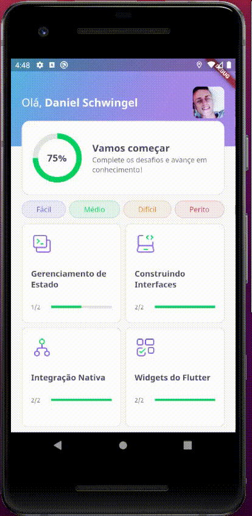

<p align="center">
  <a href="https://github.com/DanielSchwingel/devquiz">
    
  </a>
</p>

# devquiz
Application developed at # NLW5. 🚀

<p align="center">
  <a href="https://github.com/DanielSchwingel/devquiz">
    
  </a>
</p>

 <p align="center">
 
 
 
 
 </p>

## ✨ Technologies
- [Flutter](https://flutter.dev/)
- [Dart](https://dart.dev/)

## 💻 Project
The devquiz is a quiz game to assess your knowledge about the development world.

## 🔖 Layout

You can view the project layout through [this link](https://www.figma.com/file/fMqKhwT9L5D3MVe4btRtG5/DevQuiz/duplicate).

## 🚀 How to use?

```bash
# Clone repository
$ git clone https://github.com/DanielSchwingel/devquiz.git

# Access the project folder
$ cd devquiz

# Run project
$ flutter run
```
## 📝 License

This project is licensed under the MIT License - see the [LICENSE](LICENSE) file for details.

---

Made with 💜 by Daniel Filipe Schwingel 👋 [Check out my LinkedIn](https://www.linkedin.com/in/daniel-filipe-schwingel-a6541515b/)